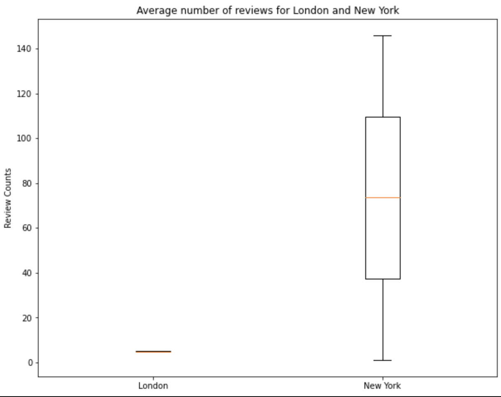
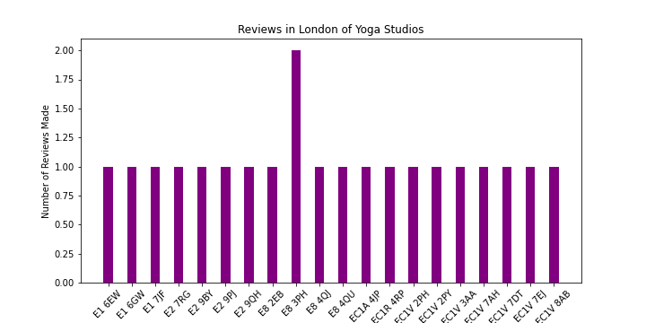
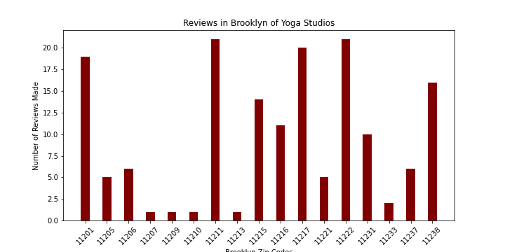

# Yelp Project
Yelp Project at  Flatiron School Phase 1 

Overview:
======
When starting a business, the most important factor to consider is business location. At Prometheus Adventures we help our customers decide where to setup their businesses. We use sophisticated APIs to make detailed reports for potential business locations.

# Target: 
For this analysis, we are analyzing where to setup a Yoga businesses within NYC and London using Yelp's API.

 
 

 

Yelp utilizes many various attributes when looking for certain types of business. Whether it is location, type of business, how expensive are the services, or the amount of reviews. By utilizing Yelp's API called Fusion, we are able to provide our customer what is the best location for setting up their business. By taking in various conditions based on the Yelp API, we can provide a detailed report based on the factors that decide the success of a business.

# Repository
All data sets can be found in the Yelp.db files. Functions we use to sift through the data can be found in the functions file. All images and graphs can be found in the image folder.

# Analysis Focus
1. All analysis focuses on the data given by Yelps Fusion API that is constantly updated on a regular basis.
2. The analysis focuses on business with the most review counts, highest average ratings, and reviews given.

# Analysis 
Our first analysis compared the pricing with the number of observations for each city. One discrepancy that we found in Yelp's API database for pricing was that not all the businesses had pricing info. This created a smaller dataset for each location. Our analysis in determining the pricing for the number of businesses is sufficient for determining where to put our business based on pricing information. The infographic displays the count of the least expensive yoga studios in comparison to the most expensive yoga studios based on location. Least expensive yoga studios being shown on the graph by the numeric number value 1; the most expensive yoga studios being shown by the numeric value 4. Based on the preference of our customers, see that London has a higher cost for the yoga studios that customers are willing to pay for in comparison to NYC where yoga studios are more reasonably priced. We have similar populations. However the results of inflation of the American dollar versus the English pound can affect preferences for yoga studio fees. 

  

# Averages of Ratings and Review Counts

We first wanted to see the average rating for each location based on which country the potential business would be located in. Solely based on the average rating, we have concluded that NYC is a more suitable location for opening a yoga studio. There are more higher ratings in the city of NYC denoted as US, in comparison to London denoted as GB. One discrepancy is that in London, Yelp is not a source that is used that often either by businesses or by customers doing local searches.

  

We have seen how the distribution on pricing can make or break business depending on what type of clientele they cater to, now we want to take this one step further to see what is average reviews for each location. This insight will help us determine which location values Yoga as a source for exercise. We see that NYC receives far higher averages and range of reviews per yoga studio than that of London. One reason for this discrepancy as we mention above, is that London businesses do not use the Yelp app to store their business information for customers to discover them. Even with this discrepancy, our data tells us that NYC yoga studios are by far more valued than in comparison to London.

  

# Reviews By Zip Code

Our final analysis honed down specifically on Brooklyn and Central London. In both of these locations we see an influx of new residents and the wealth per capita has increased significantly in these areas. From this idea, we realized that people with more money have more time and resources to be allocated to their health. Yoga now being one of the most popular trends when it comes to health of the body and mind. We see that on average in Central London the number of reviews being made are just around 1 for each zip code. With Brooklyn we are seeing roughly 12 reviews for each zip code showing how the people of Brooklyn value the practice of yoga much more than in Central London.

  

  

# Summary
From the analysis done at Prometheus Adventures considering multiple conditions based on these two cities we have concluded that opening a yoga studio is best in Brooklyn, NY. We have decided the is the best decision for our client based on analysis seen above. We see that Brooklyn has more reviews. The cost of running a yoga studio is moderately cheaper based on the prices their customers will have to pay. Another crucial factor is how NYC values their health more when it comes to having Yoga to facilitate their health needs. The aforementioned points lead to the conclusion that Brooklyn is the best location to open a brand new yoga studio.

# Presentation 

[Presentation](https://github.com/Astroraf/Yelp_Project/blob/main/Yelp%20Project%20Presentation%20.pdf)

# Contributors 

[Rafael Ferreira](https://github.com/Astroraf)

[John Silverman](https://github.com/silvermanjonathan) 
